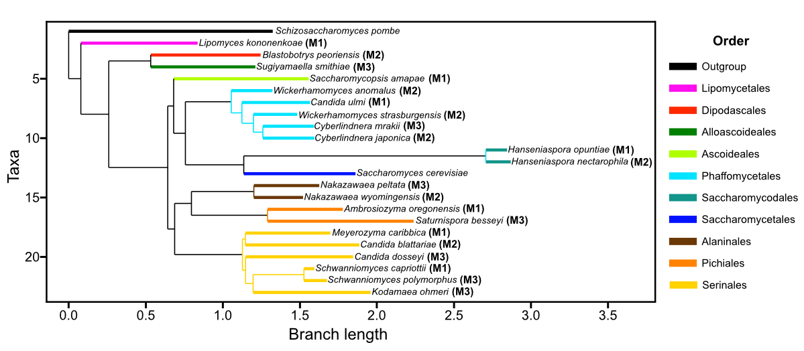

# Pan-transcriptomics in the yeast subphylum

<!-- Replace with the Zenodo badge after the first GitHub release is archived:
 -->

Pooled RNA-sequencing of 21 non-filamentous yeast species spanning all the taxonomic orders of the subphylum *Saccharomycotina*, grown in rich medium (YPD), showing that most biological pathways evolve while conserving their transcriptomic cohesion and that variation in gene content only occasionally enables transcriptomic divergence, mostly in pathways of low prevalence across the subphylum.

## Study design
We chose the number of genes and species to profile with power analyses targeting the two main comparisons of the study: (1) the difference in expression variability between the core and accessory genomes (Wilcoxon rank-sum test; ~4000 genes or orthogroups needed for power >= 0.8 at very low effect size) and (2) per-orthogroup or per-pathway regressions on pairwise species comparisons (n = 20 species for a power of 0.8 at f = 0.14). The species were then drawn at random from the collection of Opulente et al. (2024) among non-filamentous, fast-growing species until every taxonomic order was represented. 

## Raw data
The pre-demultiplexed RNA-seq data are archived in NCBI SRA (PRJNAXXXXXX).

## RNA sequencing
Each species was grown separately to mid-log phase in YPD and total RNA was extracted in two biological replicates. The RNA of 7 species was pooled at equal concentration into each of three mixtures (M1, M2 and M3, at most 2 species of the same clade per pool), yielding 6 pooled YPD samples. The Centre for Applied Genomics (TCAG, Toronto) prepared poly-A-selected libraries and sequenced them on an Illumina NovaSeq X (10B flow cell, 150 bp paired-end, ≥ 50 M read pairs per library). The raw reads were stored in NCBI SRA (BioProject PRJNAXXXXXXX) and demultiplexed computationally to their species of origin with the scripts in the *RNA_sequencing* folder. The pipeline is customized for our Slurm environment (usernames, configuration, file paths, dependencies and resources need to be customized to your own computing environment):
- sbatch make_multispecies_references.sh
  - Prefixes every contig of each species' genome FASTA and GTF with the species name and combines the 7 species of a pool into one multi-species reference
  - Dependencies: StdEnv/2023

- sbatch submit_pooled_RNA_seq_binning_counts.sh
  - Read cleaning (fastp), splice-aware mapping to the multi-species reference (STAR), splitting of the alignments per species (samtools) and per-gene read pair counts (featureCounts)
  - Dependencies: StdEnv/2023, fastqc, fastp, star, samtools, subread and multiqc

- Binning quality control: the reads left unmapped by STAR were profiled with CCMetagen/kma against a database of the 21 species. The QC report is *Yeast_subphylum_pan_transcriptomic_study_sample_preprocessing_and_QC.html* and its figures are in *RNA_sequencing/QC_figures*
  - Dependencies: kma and CCMetagen

-The reference fasta and gtf files for the 21 species: Opulente et al. (2024), [doi:10.1126/science.adj4503](https://doi.org/10.1126/science.adj4503), [figshare collection 6714042](https://figshare.com/collections/Genomic_and_ecological_factors_shaping_specialism_and_generalism_across_an_entire_subphylum/6714042)

-The list of samples (*list_of_samples.tsv*) and the composition of each pool, with NRRL strain symbols and GenBank assembly accessions (*pool_composition_21_species.tsv*)

| Pool | Species (NRRL strain) |
|---|---|
| M1 | *Ambrosiozyma oregonensis* (Y-6106), *Candida ulmi* (Y-2694), *Hanseniaspora opuntiae* (Y-27512), *Lipomyces kononenkoae* (Y-63818)†, *Meyerozyma caribbica* (Y-27274), *Saccharomycopsis amapae* (Y-17845)†, *Schwanniomyces capriottii* (Y-7423)† |
| M2 | *Blastobotrys peoriensis* (YB-2290), *Candida blattariae* (Y-27703), *Cyberlindnera japonica* (YB-2750), *Hanseniaspora nectarophila* (Y-63754), *Nakazawaea wyomingensis* (YB-2152), *Wickerhamomyces anomalus* (Y-366), *Wickerhamomyces strasburgensis* (Y-2383) |
| M3 | *Candida dosseyi* (Y-27950), *Cyberlindnera mrakii* (Y-1364), *Kodamaea ohmeri* (Y-1932), *Nakazawaea peltata* (Y-7303), *Saturnispora besseyi* (YB-4711)†, *Schwanniomyces polymorphus* (Y-2022)†, *Sugiyamaella smithiae* (Y-17849) |

† Did not reach the minimum coverage of ~0.5 M binned reads (~100 reads per orthogroup) and was excluded from the downstream analyses, which use 16 species and 9,409 orthogroups.

## Downstream analyses
- Rscript Yeast_pan_transcriptomics_analysis.R *(to be added)*
  - Validation of the binned expression data (PCA distance and pairwise R² vs phylogenetic distance, replicates vs non-replicates; *QC_figures/Sample_pairs_expr_Rsq_for_replicates_vs_nonreplicates_in_YPD.svg*)
  - Evolutionary force acting on each pathway: R² vs phylogenetic distance slope and Bray-Curtis distances compared to 999 random orthogroup sets of the same size, with FDR correction and power estimates (pwr, MKpower)
  - Transcriptomic trajectory of expanding orthogroups (Jensen-Shannon ESD and R² slope Spearman markers over sliding copy number thresholds)
  - Dependencies
    - r/4.2.2; Libraries ggplot2, seqinr, RColorBrewer, randomcoloR, FD, vegan, gplots, lmPerm, ggpubr, gridExtra, cluster, tidyr, doParallel, foreach, ape, dplyr, and eulerr.
- Varpart_Fitness_Yeast_datasets.py: GREML variance partitioning of the transcriptome (core vs accessory orthogroups, with 500 downsamples of 16 *S. cerevisiae* strains from Caudal et al. 2024) and of fitness (gene content, phylogenetic distance and expression, 99 bootstraps)
  - Dependencies
    - Python 3.6; Packages: sys, multiprocessing, contextlib, csv, gzip, os, scipy, numpy, sklearn, pandas, datetime, math, and random.
      
## Citation
N'Guessan, A. (2026). *Pan-transcriptomics in the yeast subphylum: Variation in gene content occasionally enables transcriptomic divergence among broadly cohesive pathways.* Chapter 4 in PhD thesis, Department of Cell & Systems Biology, University of Toronto.

Opulente, D. A. et al. (2024). Genomic factors shape carbon and nitrogen metabolic niche breadth across Saccharomycotina yeasts. *Science* 384, eadj4503.
